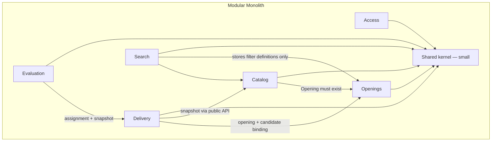
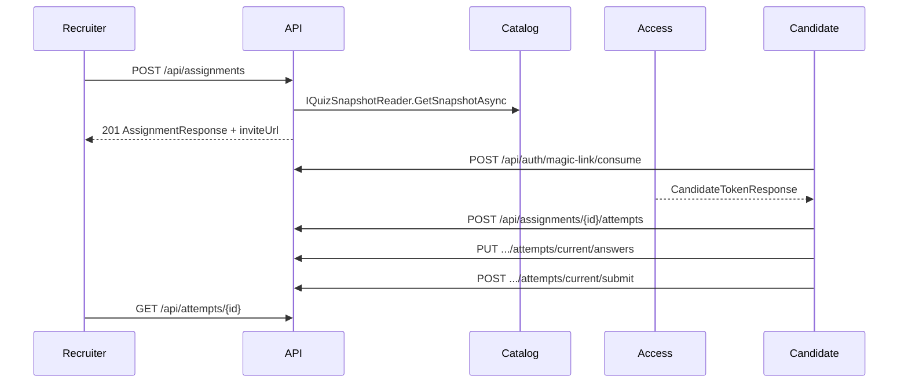

# Interview Quiz Platform — Architecture

Status: v1 architecture record — slices **1–5 implemented**; **slice 6** live start/pause later.  
Platform skill: `enterprise-architecture-onprem.md`  
Client shape: **Angular SPA + installable PWA, online-first** (no Ionic / Capacitor)  
AuthN (given, not chosen here): **JWT bearer**; ASP.NET Core Identity as the user store; candidate magic-link (protocol in ADR 0008 + §16.3, **implemented**); Entra ID later as external login. Auth owns issuance, storage, and protocol **within that lock**.  
AuthZ: permission-based capability catalog (see `docs/permissions.md`). Never `[Authorize(Roles = ...)]`.

---

## 1. Goals and constraints

Internal openings-first interview quiz platform. Replaces Microsoft Forms packs. Sits beside hiring process; **not** an ATS, **not** a public career portal.

**Users:** recruiters, specialist template authors (Dev / QA / HR / Finance), admins, candidates.

**v1 goals:** searchable quizzes tied to openings; specialist-owned templates; a Catalog-owned **question bank** (reusable items, copy-on-include); one quiz model for live and async; AI as draft-only (last slice); tags and saved filters instead of org hierarchy.

**Locked hosting:** on-premises VMs, reverse proxy, self-hosted data. No Azure or AWS services as defaults. No commercial libraries, paid IdPs, paid APM, or paid sync.

**Stack:** ASP.NET Core Modular Monolith, EF Core, PostgreSQL, Angular. REST. Simple DDD. One company (not multi-tenant SaaS).

---

## 2. Assumptions (explicit)

Master defaults are **accepted**; Architecture does not override them:

| Topic | Assumption |
|--------|------------|
| Template edits | New version; existing assignments keep the old version. Working copy is always a **quiz**. Slice 3 has no in-place template editor — clone → edit quiz → publish creates the next version. |
| Assignment | Stores a snapshot of questions, keys, and scoring rules. |
| Quiz reuse | A quiz belongs to **one** opening. Reuse across openings is via **template**. This overrides Brief §6.2 “linked to one or more openings” in favor of Brief §16. |
| Question bank | Catalog-owned **item** library. Same types/scoring/credit as quiz questions. **Copy-on-include** (new quiz question id; `sourceQuestionId` provenance). Not a new bounded context. Distinct from templates (whole-quiz reuse) and from the drag-drop `dragDropSharedBank` question type. ADR 0007. Bank CRUD + Angular UI is **slice 4** (implemented); groundwork is in slice 3. |
| Template lineage | First publish of a quiz with no origin creates a template. Later publish from **that quiz** or from a quiz **cloned from that template** creates a **new version** of the same lineage. No always-new-template. No fork-to-new-lineage in slice 3. |
| Ordering partial credit | Default formula: **adjacent-pair**. Slice 5 auto-score uses it for ordering `partial`; slice 7 review still later. Ties/duplicates remain Evaluation-owned. |
| Retention | Configurable archive (default 5 years). **No hard delete.** Separate restore rules for resumes, attempts, quiz content. Restore is an admin permission (split codes below). |
| Company AI rules | Versioned JSON: global layer + required fields per question type. Concrete schema deferred to the AI slice. |
| Async attempts | One attempt unless the assignment override allows another. |
| Tenancy | Single internal company. |
| AI runtime | Last slice (now **slice 8**). Operator-configured **OpenAI-compatible HTTP** endpoint (self-hosted or otherwise). Not Azure OpenAI. First slices have **no LLM**. |
| AuthN | JWT + Identity store + magic-link + Entra-later is a **given**. Architecture does not design Cookie vs JWT. |
| CQRS | **No.** Application services in each module. Never MediatR. See ADR 0005. |
| Data | One PostgreSQL database, module-owned schemas, until a split is justified. See ADR 0003. |
| Files | Resumes and other binaries on local / NAS disk; paths in PostgreSQL. Not a cloud object store. |
| Live progress | REST start / pause / poll in v1. SignalR is optional later (OSS only); not required. |
| Network | SPA and API same-site behind one reverse proxy (simplifies cookies if Auth ever needs them; JWT still works). Split origins need an explicit CORS allowlist — not the default. |
| CI | Self-hosted runners. Exact product (GitHub Actions, GitLab, Jenkins, Azure DevOps Server) is **unknown** — DevOps confirms what ops already run. |

Open questions that remain product/Auth-owned are listed in §11.

---

## 3. Context diagram

Request path: browser → reverse proxy (TLS) → Kestrel. The proxy serves the Angular app and forwards `/api` and `/health` to the monolith. PostgreSQL and the file store are internal. The OTel Collector is the only telemetry backend named here.

---

## 4. Bounded contexts (module map)

One ASP.NET Core host. In-process modules with **public application contracts**; other modules do not read another module’s tables. Shared kernel stays small: identifiers, pagination, tag key–value value object, permission code constants, clock. **No** domain entities in the kernel. Aggregates only where invariants need them (quiz graph, assignment + snapshot, attempt scoring completeness, role as a permission set).

### 4.1 Access

**Language:** user, permission, role (operator-composed bundle), JWT, magic-link, later Entra link.

**Owns:** employee and candidate user records (ASP.NET Core Identity as store), permission catalog seed, roles as permission sets, role assignment, JWT issue / revoke (Auth implements), candidate magic-link issuance/consumption (Auth implements), later Entra as Identity external login. After Entra login the **same app still issues JWTs**.

**Does not own:** Cookie vs JWT choice (already given). Opening/quiz business rules.

**Public contracts (REST):**

- `POST /api/auth/login`, `POST /api/auth/refresh`, `POST /api/auth/logout` (revoke) — employees
- Slice 5 **implemented** (§16.3, ADR 0008): `POST /api/auth/magic-link/consume`; recruiter issue is `POST /api/assignments/{id}/invite` (`assignments.write`, Delivery host + Access `IMagicLinkService.IssueAsync` / `BuildInviteUrl`)
- `GET /api/me`, `GET /api/me/permissions`
- `GET /api/permissions` — catalog for the role editor (`roles.manage`)
- `GET|POST|PUT|DELETE /api/roles`, assign/unassign users
- `GET|POST|PUT /api/users` (`users.manage`)
- Later: Entra challenge / callback, then app JWT

**In-process:** resolve current user; effective permission set; assignment-scoped candidate principal (`assignment_id` / optional `attempt_id` claims + `candidate.attempt.participate` — resource check, not a role-name check). Find-or-create Identity user by candidate email on consume.

**Permissions defined here:** `users.manage`, `roles.manage`, archive restore codes (admin).

### 4.2 Openings

**Language:** opening, handler, dynamic field definition, tag (key–value).

**Owns:** openings (title, JD, owner, dates, headcount, experience, handlers), admin default field keys, per-opening values, extra keys where permitted. No rigid org tree.

**Does not own:** quizzes, assignments, filters UI storage.

**Public contracts:**

- `GET|POST|PUT /api/openings`
- `GET /api/openings/{id}`
- `GET|PUT /api/opening-field-definitions` (`openings.fields.manage`)

**In-process:** `GetOpening(id)` for Catalog (quiz must reference one opening) and Delivery.

**Permissions:** `openings.read`, `openings.write`, `openings.fields.manage`.

### 4.3 Catalog

**Language:** quiz, template, template version, template lineage, question, question bank (item library), bank item, `sourceQuestionId` (provenance), question type, scoring mode (auto / AI-assist / human-only), credit mode (partial / all-or-nothing), company AI rule set.

**Owns:** quizzes (working copy under **one** opening), templates and versions, **question bank items** (slice 4 table; same `Question` shape as quiz questions), question types listed in Brief §7 (no code questions in v1), per-question scoring and credit modes, company AI rule sets as versioned JSON. AI **draft jobs** in slice 8 (resume + opening + optional template + rules → draft quiz; human edit gate before assign).

**Does not own:** assignment lifecycle, attempts, live session control, saved-filter storage (Search).

**Public contracts:**

Slice 2 **implemented** (REST, camelCase JSON): `GET|POST /api/quizzes`, `GET|PUT /api/quizzes/{id}`. Permissions: list `quizzes.read`; create/update `quizzes.write`; get by id `quizzes.read` **or** `quizzes.write`. Question `type` / `scoringMode` / `creditMode` are strings (`multipleChoiceSingle`, `auto`, `partial`, …). `creditMode` is required only for `multipleChoiceMulti` and `ordering`. A quiz belongs to **exactly one** opening. Code question types are rejected.

Slice 3 **implemented** (paths, DTOs, permissions in §15): `POST /api/quizzes/{id}/publish-template`; `GET /api/templates`, `GET /api/templates/{id}`, versions list/get, clone; quiz list criteria expanded so Search-stored filters execute here (`openingId`, `keyword`, experience range, `tags`, `criteria` JSON — §15.3).

Slice 4 **implemented** (REST, camelCase JSON): table `catalog.bank_questions`; `GET|POST /api/questions`, `GET|PUT /api/questions/{id}`, archive/unarchive, `POST /api/quizzes/{quizId}/include-questions`; registered `IQuestionBankReader`; Dev Template author seed includes `questions.read` / `questions.write`. Angular: `/questions`, `/questions/new`, `/questions/:id`; quiz editor include panel.

Later (not this pass):

- `GET|POST|PUT /api/ai-rule-sets` (`ai.rules.manage`) — schema in AI slice
- Slice 8: `POST /api/ai-drafts` (`ai.draft.use`); draft is never auto-assigned

**In-process:**

- `IQuizSnapshotReader.GetSnapshotAsync(quizId)` → immutable DTO of questions, keys, scoring rules. **Delivery copies this at assign time** (slice 5, **implemented**). Never live-join quiz or bank tables at attempt time. Snapshot questions include `sourceQuestionId`.
- `IOpeningLookup.GetOpeningAsync(id)` — already used; clone and quiz write still require the opening to exist.
- Slice 3: template version read for clone (Catalog-internal; other modules still must not read `catalog` tables).
- `IQuestionBankReader.GetByIdAsync(id)` — registered; **include only** (not quiz create/update/publish/clone). GetById may return archived items so include can reject them.

**Permissions:** `quizzes.read`, `quizzes.write`, `templates.read`, `templates.write`, `questions.read`, `questions.write` (granted on Dev Template author Development seed), `ai.rules.manage`, `ai.draft.use`.

**Versioning:** template publish → new version. Quizzes are mutable working copies; freeze is the **assignment snapshot**, not a full quiz history in v1. Bank item edits (slice 4) mutate the library row only; copies already in quizzes/templates/snapshots stay as they were.

**Three reuse mechanisms (do not conflate):**

| Mechanism | What is reused | How |
|-----------|----------------|-----|
| Template | Whole quiz (metadata + questions) | Publish / clone; new question ids; lineage via `originTemplateId` |
| Question bank | One **item** (type, stem, scoring, credit, body) | Copy-on-include; new question id; `sourceQuestionId` → bank item |
| `dragDropSharedBank` | Tokens **inside one question** | Question-type body; not a company library |

### 4.4 Delivery

**Language:** assignment, candidate contact, mode (live | async), timing rules, attempt policy, snapshot, live session.

**Owns:** binding of a quiz snapshot to a candidate under an opening; live vs async as a **property of the assignment**; **overall** duration (per-section timing **deferred** — quizzes have no section aggregate); attempt limit (default one async attempt); live start / pause / monitor (**slice 6** REST, not slice 5); magic-link **target** (token hash + consume are Access). Snapshot **row + JSONB** at assign time.

**Does not own:** scoring, review workflow, template library, question bank, JWT protocol.

**Public contracts (slice 5 implemented — §16):**

- `GET|POST /api/assignments`, `GET /api/assignments/{id}`
- `POST /api/assignments/{id}/invite` — recruiter copies async URL (no SMTP)
- Slice **6** (do not implement in slice 5): `POST /api/assignments/{id}/live/start|pause`, `GET /api/assignments/{id}/live/progress`

**In-process:**

- `IAssignmentSnapshotReader.GetAssignmentWithSnapshotAsync(id)` for Evaluation (frozen graph + keys; Delivery tables only)
- `IAssignmentInviteInfo.GetAsync(id)` for Auth (mode, status, candidate email, invitable?)
- `IAssignmentLifecycle.NotifyAttemptStarted` / `NotifyAttemptSubmitted` (Evaluation → Delivery; keeps list status without Delivery reading `evaluation` tables)

**Permissions:** `assignments.read`, `assignments.write`, `sessions.live.run` (live run unused until slice 6).

### 4.5 Evaluation

**Language:** attempt, answer, auto-score, AI-assist draft, human review, final result.

**Owns:** attempts (answers, timestamps, duration); immediate auto-score of `auto` items on submit; written items until every non-auto item is settled (**slice 7**); AI-assist as **auditable drafts** (slice 7); final score/outcome. Archive/restore of attempts metadata (files via file store).

**Does not own:** assignment creation, quiz authoring, magic-link tokens.

**Public contracts (slice 5 implemented — §16):**

- Candidate (resource-scoped JWT): `POST /api/assignments/{id}/attempts`, `GET /api/assignments/{id}/attempts/current`, `PUT .../current/answers`, `POST .../current/submit`
- Employee (`attempts.read`): `GET /api/assignments/{id}/attempts`, `GET /api/attempts/{id}` — **basic results**, not review
- Slice **7** (do not implement in slice 5): `POST /api/attempts/{id}/items/{itemId}/review` (`attempts.review`); AI-assist suggestion

**In-process:** consume `IAssignmentSnapshotReader`; call `IAssignmentLifecycle`; never read `catalog` or `delivery` tables.

**Permissions:** `attempts.read`, `attempts.review` (review unused until slice 7). Candidate uses `candidate.attempt.participate` (Access catalog, not an employee role).

### 4.6 Search (saved filters)

**Language:** saved filter, target (`openings` / `quizzes` / `templates` only in v1 through slice 5), personal vs shared, share mode (`private` / `publicInsideCompany` / `specificUsers`).

**Owns:** stored filter definitions (target, criteria JSON, owner, share mode, share list). **Does not execute** domain queries — Openings and Catalog list endpoints accept the **same criteria shape** Search persists. Search does not read `openings` or `catalog` tables.

**Public contracts:** slice 3 **implemented** (§15.5).

- `GET|POST /api/filters`
- `GET|PUT|DELETE /api/filters/{id}`
- `POST /api/filters/{id}/share`, `POST /api/filters/{id}/unshare`

**Permissions:** `filters.write` (mutate **own** filters); `filters.share` (share/unshare **own** filters, plus ownership resource check). `GET` is authenticated and returns filters the caller can see (owned, public-inside-company, or listed in `sharedWithUserIds`). There is **no** `filters.read` code. Applying criteria on a list endpoint requires only the matching `*.read` (or quiz get’s read-or-write) permission — the client sends `criteria` JSON; list endpoints do **not** join `filterId` into Search.

Persistence is schema `search` (`SearchDbContext`, table `filters`). Search does not read `openings` or `catalog` tables.

---

## 5. Data

| Store | Use |
|--------|-----|
| **PostgreSQL** (one database) | All module tables. Schemas: `access`, `openings`, `catalog`, `delivery`, `evaluation`, `search`. JSONB for dynamic fields, question graphs, **assignment snapshots**, filter criteria, AI rule JSON. Slice 3 **has** `catalog.templates` / `catalog.template_versions` (owned questions with `SourceQuestionId`) and `search.filters`. Slice 4 **has** `catalog.bank_questions` (no FK from `catalog.questions.source_question_id`). Slice 5 **has** `delivery.assignments` + `delivery.assignment_snapshots` (JSONB copy of `QuizSnapshotDto`), `evaluation.attempts` + `evaluation.attempt_answers`, `access.magic_link_invites` (hashed opaque tokens). |
| **Local / NAS files** | Resume uploads and future attachments. DB holds path + content type + owning module id. |
| Not used in v1 | Redis as a default, document DB, cloud blobs, message bus. |

EF Core migrations, expand/contract. Dummy seed in Development only.

**Retention:** status/archived-at (or equivalent) per policy family — resumes, attempts, quiz/template/bank content. Configurable years (default 5). Restore requires the matching `archive.restore.*` permission. `archive.restore.catalog` covers quizzes, templates, bank items, and rule sets. No silent hard delete.

---

## 6. Client shape

**Angular SPA + installable PWA.** Online-first. **No Ionic, no Capacitor, no Nx** unless a later dedicated decision.

| Capability | v1 |
|------------|----|
| Web app manifest + `@angular/service-worker` | Yes — installable on supporting browsers |
| Cache hashed app shell | Yes |
| Cache authenticated APIs, tokens, `/me`, login/refresh, quiz payloads, answers, **assignments, attempts, magic-link** | **No** |
| IndexedDB outbox for attempts | **No** |
| Offline authoring / taking a quiz | **No** — show “you are offline” |
| Timed live/async, scoring, magic-link as offline mutations | **No** (integrity, anti-cheat, resume PII) |

Details: `docs/adr/0004-pwa-online-first.md`. Angular implements; this ADR is the product rule.

Candidate and employee UIs may share the SPA with different routes; Auth owns branded entry routing.

**Implemented employee routes** (Angular `app.routes.ts`; permission on the route, same codes as the API):

| Path | Permission | Screen |
|------|------------|--------|
| `/login` | guest (unauthenticated) | Sign in |
| `/` | authenticated | Home |
| `/openings` | `openings.read` | Opening list |
| `/openings/new` | `openings.write` | Create opening |
| `/openings/:id` | `openings.read` | View / edit opening |
| `/quizzes` | `quizzes.read` | Quiz list |
| `/quizzes/new` | `quizzes.write` | Create quiz |
| `/quizzes/:id` | `quizzes.read` **or** `quizzes.write` | View / edit quiz |
| `/templates` | `templates.read` | Template library list/search |
| `/templates/:id` | `templates.read` | Template detail + versions |
| `/questions` | `questions.read` | Question bank list |
| `/questions/new` | `questions.write` | Create bank question |
| `/questions/:id` | `questions.read` **or** `questions.write` | View / edit bank question |
| `/opening-fields` | `openings.fields.manage` | Opening field defaults |
| `/roles`, `/roles/new`, `/roles/:id` | `roles.manage` | Role list / editor |
| `/users`, `/users/new`, `/users/:id` | `users.manage` | User list / form |
| `/assignments` | `assignments.read` | Assignment list (opening, keyword, pager; **no** SavedFilters) |
| `/assignments/new` | `assignments.write` | Create assignment (opening, quiz for that opening, email, async/live, duration, attempt limit) |
| `/assignments/:id` | `assignments.read` | Assignment detail, copy invite (`assignments.write`), basic results if `attempts.read` |

**Candidate (not the employee shell; implemented):** `/attempt?token=` — consume magic-link (ADR 0008). Isolated in-memory `CandidateSession` (not employee `TokenStore`). Auth still owns branded employee-vs-candidate entry UX; this is the invite landing path.

Nav and home link to Quizzes when the user has `quizzes.read`. Assignments nav when `assignments.read`. Create assignment hidden without `assignments.write`. Recruiter seed has `assignments.write`; a typical template author does not. Create quiz is hidden without `quizzes.write`. Recruiter (read only on quizzes) sees a disabled form; author (write) gets the full editor. Templates nav when `templates.read`. Clone-into-opening is hidden unless the user has **both** `quizzes.write` and `templates.read`. Publish-as-template is hidden without `templates.write`. Question bank nav (shell + home **Question bank**) when `questions.read`. Include from question bank on the quiz editor requires `quizzes.write` **and** `questions.read` on an existing saved quiz (hidden on create-new). Recruiter without `questions.*` does not see bank nav or include. Saved filters live on list screens (openings / quizzes / templates), not a separate admin module, **not** on the question bank list (no `FilterTarget = questions`), and **not** on the assignment list (no `FilterTarget = assignments`). Feature screens keep list/editor state in component signals. Session is `AuthService` (`currentUser`, `sessionReady`); candidate `/attempt` uses in-memory `CandidateSession` isolated from employee `TokenStore`; permissions are `PermissionService`. There is no global entity store.

Shared UI primitives: [`docs/components/README.md`](components/README.md). Playbook markdown pages are the source of API tables. OSS Storybook 10 (`@storybook/angular-vite`, Angular 21 zoneless application builder) is the isolated gallery for those primitives (`npm run storybook` in `src/interview-quiz-web` → http://localhost:6006). No Chromatic.

---

## 7. Hosting (on-premises)

Skill used: **`enterprise-architecture-onprem.md`**. Azure/AWS skills were not used.

| Concern | Choice |
|---------|--------|
| Compute | Single Modular Monolith on Kestrel, **behind a reverse proxy** (nginx, IIS, or equivalent already in the datacenter). Containers optional if ops already run Docker — not required to ship. |
| TLS | Terminated at the reverse proxy. HTTP from proxy to Kestrel on the internal network. |
| SPA | Same-site: proxy serves static Angular output and `/api`. |
| PWA cache | Proxy **must not** aggressively cache `index.html` or `ngsw.json` (always revalidate). Hashed assets may be long-cached. |
| Secrets | Environment variables, OS-protected files, or HashiCorp Vault (OSS). **Not** cloud KMS. |
| Observability | App **emits** OpenTelemetry traces/metrics + structured logs. **Goes to** an on-prem OTel Collector and files / existing OSS stack. No paid APM. |
| Health | `GET /health/live` (process), `GET /health/ready` (PostgreSQL + file store). CD waits on ready. |
| Correlation | Accept `traceparent` and/or `X-Correlation-ID`; generate if missing; echo to clients. Angular logs status + correlation id, not bodies with PII. |
| Environments | **Dev** (local seed, Docker Compose PostgreSQL), **Test**, **Prod**. No cloud environment names. |
| Dev data | Docker Compose PostgreSQL for local development. |
| CI/CD | Self-hosted runners; DevOps matches this platform. |
| AI (slice 8) | Configured base URL + secret via env/Vault. Operator’s OpenAI-compatible endpoint. |
| Entra (later) | App calls Entra as external IdP; still issues app JWTs. No paid IdP product. |

Suggested env **names** (values never in git): `ConnectionStrings__InterviewQuiz`, `FileStorage__Root`, `Jwt__Issuer`, `Jwt__Audience`, `Jwt__SigningKey`, `Jwt__AccessTokenMinutes`, `Jwt__RefreshTokenDays`, `Jwt__CandidateAccessTokenMinutes` (slice 5 candidate JWT; default 60, range 1–180), `PublicBaseUrl` (origin for invite URLs, no trailing slash; not a secret), `OTEL_EXPORTER_OTLP_ENDPOINT`, `OTEL_SERVICE_NAME`, `Retention__Years`, later `Ai__BaseUrl` / `Ai__ApiKey`.

---

## 8. Observability — emit vs destination

| Emit (app) | Destination (on-prem) |
|------------|------------------------|
| Structured logs (templates, no secrets) | Files and/or collector |
| OTel traces named after use cases (assignments.create, assignments.list, assignments.get, assignments.invite, auth.magic-link.consume, attempts.start, attempts.save, attempts.submit, attempts.score, attempts.get, live start, templates.publish, templates.clone, filters.write) | OTel Collector |
| Metrics: request duration, error rate, dependency duration | OTel Collector |
| Health live/ready | Reverse proxy / CI |
| Angular HTTP failures: status + correlation id | API log ingest or collector; **no tokens, no resume text, no answers** |

Intentionally light in v1: no PWA outbox metrics (no outbox). Do not trace raw quiz payloads, stems, or answer bodies. Log **assignment id / attempt id / opening id / quiz id**, not candidate email, answers, or stems. Client OTel JS exporter is optional and not required.

---

## 9. Integration style

- **REST** between Angular and the monolith.
- **In-process** module calls for snapshot, opening existence, assignment fetch, later bank read.
- **No** integration event bus, sagas, or domain-event storm in v1.
- Cross-module rule: Delivery **copies** a Catalog snapshot at assign time; it does not join live quiz tables **or live bank tables** at attempt time. Template publish and bank include are the same copy rule.

---

## 10. Risks

- **Integrity of timed attempts** if anyone caches or replays quiz payloads — mitigated by online-first PWA rules and no API cache.
- **Resume PII** on disk and in logs — file store ACLs, no PII in telemetry, retention/restore permissions.
- **Magic-link and JWT theft** — Auth + Security; Architecture only records that candidate tokens must be assignment-scoped.
- **Single host capacity / patch windows** — one monolith first; backup and migration outage are ops realities, not invented SLAs.
- **AI endpoint reachability and prompt leakage** (slice 8) — operator-owned HTTP; never default to a cloud LLM.
- **Entra later** must not fork a second authZ model — same permission catalog, same app JWTs.
- **Filter/tag inconsistency** is a product risk (Brief goal 6), not solved by a rigid hierarchy in software.

No numeric SLAs or KPIs are claimed; Brief §13 is qualitative until a Forms baseline exists.

---

## 11. Open questions (owners)

| Question | Owner |
|----------|--------|
| One branded auth entry that routes employee vs candidate (magic-link / password) — exact UX and routes | **Auth** (product still open; working direction in `requirements/Open questions.md`) |
| Employee JWT storage in the SPA (memory vs session); candidate token isolation vs employee session | **Angular implemented** employee `TokenStore` (access in memory, refresh in `sessionStorage`) and candidate `CandidateSession` (in-memory only, no refresh). Branded employee-vs-candidate entry UX still **Auth** + product |
| Magic-link issue/consume, claims, hashed invites | **Implemented** §16.3 / ADR 0008 (`IMagicLinkService.IssueAsync` + `BuildInviteUrl`; env names `PublicBaseUrl`, `Jwt__CandidateAccessTokenMinutes`) |
| Exact restore UX per policy family (already: separate permissions, no hard delete) | **Master / product**; Access + owning modules implement |
| Concrete company AI JSON schema | **Catalog (.NET)** in slice 8 |
| Adjacent-pair scoring edge cases (ties, duplicate items) | **Evaluation (.NET)** — auto-score is in slice 5; edge cases remain Evaluation-owned |
| Reverse proxy product, DMZ vs internal zones, Vault vs env | **DevOps** + ops |
| Which self-hosted CI already exists | **DevOps** |
| Threat model of live “watch the screen” vs app-side controls | **Security** (not Architecture) |
| Fork-to-new-template (publish a cloned quiz as a **new** lineage instead of versioning the origin) | **Product / Master** — out of slice 3; default is stay in lineage (§15.1) |
| Recruiter instantiate-from-template (clone requires `quizzes.write`; Dev Recruiter seed does not have it) | **Product / Master** — slice 3 clone is an authoring action; assignment (slice 5) binds an existing quiz |

---

## 12. First slices (Brief §14, with bank inserted)

Vertical slices. Each slice is not done until the collaboration skill DoD holds (permission on API + UI, migrations, tests, correlation id, no secrets, contract updated).

| Slice | Status | What | Modules |
|-------|--------|------|---------|
| **1 Foundations** | Implemented | Users, permission catalog + role editor, openings + dynamic fields/tags, Angular shell / PWA | Access, Openings, Angular |
| **2 Authoring** | Implemented | Quiz authoring API + Angular list/editor; eight v1 question types; scoring and credit modes | Catalog, Angular |
| **3 Templates and search** | Implemented | Publish template, versions, list/search, clone into opening, saved/shared filters; **question-bank groundwork** (`sourceQuestionId`, reserved `IQuestionBankReader`, `questions.*` seeded) | Catalog, Search, Access, Angular |
| **4 Question bank** | Implemented | Authoring library + include-into-quiz (copy-on-include); Angular list/editor and quiz include panel; `questions.read` / `questions.write` on Dev Template author seed | Catalog, Angular |
| **5 Assignments** | **Implemented** | Candidate assignment, snapshot, async timed link, auto-score, basic results, Angular employee + `/attempt` | Delivery, Evaluation (submit + auto-score), Access (magic-link), Angular |
| **6 Live mode** | Later | Start/pause/monitor on the **same** assignment model | Delivery |
| **7 Review** | Later | Human + AI-assist marking, auditable drafts, finalise | Evaluation |
| **8 AI draft** | Later | Resume + opening + rules → draft → forced human edit | Catalog (+ file store, operator LLM HTTP) |

No LLM in slices 1–6. Slice 7 AI-assist may call the same operator endpoint when configured; if unset, human-only review still works. Slice 8 is the first **authoring** LLM path.

---

## 13. ADRs

| ADR | Topic |
|-----|--------|
| [0001](adr/0001-hosting-on-premises.md) | On-premises hosting; Azure/AWS out of scope |
| [0002](adr/0002-modular-monolith.md) | Modular Monolith, REST, simple DDD |
| [0003](adr/0003-data-postgresql.md) | PostgreSQL + JSONB; one DB until split |
| [0004](adr/0004-pwa-online-first.md) | Installable PWA, online-first, shell cache only |
| [0005](adr/0005-no-cqrs.md) | No CQRS, no MediatR |
| [0006](adr/0006-auth-given-jwt-identity.md) | JWT + Identity + magic-link + Entra-later as given |
| [0007](adr/0007-question-bank-copy-on-include.md) | Question bank in Catalog; copy-on-include; `sourceQuestionId` |
| [0008](adr/0008-magic-link-reusable-until-submit.md) | Opaque invite in URL; reusable until first submit; candidate JWT assignment-scoped |

Permission catalog: [`docs/permissions.md`](permissions.md). Slice 5 REST: §16.

---

## 14. Delivery status

Slices **1–5** are implemented. Hosting and auth ADRs (0001, 0006) are unchanged. ADR 0007 records the bank. ADR 0008 records the magic-link (implemented).

Still later: live mode (slice 6), review (slice 7), AI draft (slice 8), production runbook, self-hosted CI (DevOps). No LLM in slices 1–6. Entra and SMTP are out of slice 5.

---

## 15. Slice 3 contracts (implemented)

Locked contract for Catalog/Search. Status: **in code**. Do not treat this section as a backlog. Slice 4 bank APIs are in §15.7. **Slice 5 assignments are in §16** (implemented).

REST, camelCase JSON, permission-based. Page defaults match `PageRequest` (page 1, pageSize 20, cap 100). No CQRS, no MediatR. Catalog and Search application services; never a mediator.

All question payloads reuse one shape (existing fields + groundwork):

`QuestionRequest` / `QuestionResponse` / `QuizSnapshotQuestionDto` / template-version questions:

| Field | Notes |
|-------|--------|
| `id` | Guid. New on create if omitted/empty; **new** on publish copy and clone copy |
| `type` | Same eight strings as slice 2 |
| `stem` | Required |
| `scoringMode` | `auto` / `aiAssist` / `humanOnly` |
| `creditMode` | Required only for `multipleChoiceMulti` and `ordering` |
| `points` | ≥ 1 |
| `body` | JSON; same validators as slice 2 |
| `sourceQuestionId` | **Nullable Guid.** Provenance of a bank include. Slice 3 **persists as sent**; does not validate against a bank. Slice 4 include sets it. Omitted/null = authored in this quiz (or provenance dropped). Stem edits do **not** auto-clear it |

`sortOrder` is list order on write (same as slice 2). Response includes `sortOrder`.

### 15.1 Template lineage (publish identity)

**One template lineage per origin, not always-new-template.**

Quiz carries server-owned `originTemplateId` (nullable Guid) on `QuizResponse`. **Not** client-writable on `CreateQuizRequest` / `UpdateQuizRequest` (ignore if sent).

| Situation | Publish does |
|-----------|----------------|
| Quiz has `originTemplateId == null` and no template exists with `originQuizId == quiz.id` | **Create** template `T`, version **1**. Set `T.originQuizId = quiz.id`. Set `quiz.originTemplateId = T.id`. |
| Quiz has `originTemplateId` set | **New version** of that template. |
| Quiz has `originTemplateId == null` but a template already has `originQuizId == quiz.id` (first publish already happened; quiz row should have been updated — recovery) | **New version** of that template; set `quiz.originTemplateId`. |
| Quiz was **cloned** from a template version | Clone already set `originTemplateId`. Publish → **new version** of that same template. |

Concurrent publish: unique `(templateId, versionNumber)`; loser retries. Publishing updates `quiz.originTemplateId` and increments quiz `rowVersion`.

**Not in slice 3:** in-place `PUT /api/templates/{id}`; fork-to-new-lineage flag; bank include API.

Template tables (Catalog schema `catalog`): `templates` (lineage: `id`, `originQuizId`, timestamps) and `template_versions` (version number, metadata snapshot from the quiz at publish, `publishedFromQuizId`, `publishedAtUtc`, `publishedByUserId`, owned questions with the same `Question` shape including `sourceQuestionId`). List/search uses **latest version** metadata (title, description, experience, tags).

### 15.2 Publish, list, get, clone

| Method | Path | Permission | Result |
|--------|------|------------|--------|
| `POST` | `/api/quizzes/{id}/publish-template` | `templates.write` | `PublishTemplateResponse` 201 |
| `GET` | `/api/templates` | `templates.read` | `PagedResult<TemplateSummaryResponse>` |
| `GET` | `/api/templates/{id}` | `templates.read` | `TemplateResponse` (lineage + latest version **metadata**, no full question bodies) |
| `GET` | `/api/templates/{id}/versions` | `templates.read` | `PagedResult<TemplateVersionSummaryResponse>` or a full list if short — prefer paged with same `page`/`pageSize` |
| `GET` | `/api/templates/{id}/versions/{versionId}` | `templates.read` | `TemplateVersionResponse` (full `questions`) |
| `POST` | `/api/templates/{id}/versions/{versionId}/clone` | `quizzes.write` **and** `templates.read` | `QuizResponse` 201, `Location: /api/quizzes/{newId}` |

Unknown template/version, or `versionId` not under `{id}` → 404. Unknown `openingId` on clone → 400 `"Opening does not exist."` via `IOpeningLookup` (Catalog does not read the `openings` schema).

**`PublishTemplateResponse`:** `templateId`, `versionId`, `versionNumber` (int, 1-based), `createdNewTemplate` (bool).

**`TemplateSummaryResponse`:** `id`, `title`, `description`, `expectedExperienceYears`, `tags`, `latestVersionId`, `latestVersionNumber`, `originQuizId`, `updatedAtUtc`.

**`TemplateResponse`:** summary fields plus `createdAtUtc`. Client loads questions from the version endpoint.

**`TemplateVersionSummaryResponse`:** `id`, `templateId`, `versionNumber`, `title`, `publishedFromQuizId`, `publishedAtUtc`, `questionCount`.

**`TemplateVersionResponse`:** summary plus `description`, `expectedExperienceYears`, `tags`, `questions` (`QuestionResponse[]` with `sourceQuestionId`).

**Clone body `CloneTemplateVersionRequest`:** `openingId` (required Guid), `title` (optional string; default = version title). Copies description, `expectedExperienceYears`, tags from the version. New quiz id. **New question ids.** **Preserve `sourceQuestionId`.** Set `originTemplateId` to the template lineage id. Store `sourceTemplateVersionId` on the quiz if useful for audit (optional nullable Guid on `QuizResponse`; not used to choose the publish target).

Publish **copies** questions from the quiz: new ids, preserve `sourceQuestionId`, snapshot title/description/experience/tags onto the version.

Activity names: `templates.publish`, `templates.list`, `templates.get`, `templates.versions`, `templates.clone`. Structured logs with template id / version number; no question bodies.

### 15.3 Template and quiz list criteria

Search persists this JSON; Catalog executes it. Field names match Openings where they overlap (`experienceMinYears`, `experienceMaxYears`, `tags`).

**`TemplateListCriteria`** (also bindable from query string; `criteria` JSON wins like openings):

| Field | Match |
|-------|--------|
| `keyword` | Case-insensitive substring on **title** (product “keyword/title”) |
| `experienceMinYears` / `experienceMaxYears` | Inclusive range on `expectedExperienceYears` |
| `tags` | All listed key/value pairs must match (same as openings) |

Query also: `page`, `pageSize`, `criteria` (full JSON).

**`QuizListCriteria`** — implemented (expanded from slice 2 `openingId`-only):

| Field | Match |
|-------|--------|
| `openingId` | Exact (existing) |
| `keyword` | Case-insensitive substring on **title** |
| `experienceMinYears` / `experienceMaxYears` | Inclusive range on `expectedExperienceYears` |
| `tags` | All listed key/value pairs must match |

Query: existing `openingId`, `page`, `pageSize`, plus `keyword`, experience range, `tags` JSON, and `criteria` (full `QuizListCriteria` JSON). Saved filters with `target: "quizzes"` must round-trip this shape.

**`OpeningListCriteria`** — already implemented; do not change field names. Saved filters with `target: "openings"` store that JSON as-is.

### 15.4 Quiz response additions (slice 3)

`QuizResponse` adds `originTemplateId` and `sourceTemplateVersionId` (nullable Guids). Questions add `sourceQuestionId`. `IQuizSnapshotReader` / `QuizSnapshotQuestionDto` add `sourceQuestionId`. EF: nullable uuid column on `catalog.questions` and template-version owned questions; **no FK** to bank items. Slice 4 added `catalog.bank_questions` and still does **not** add an FK from `catalog.questions.source_question_id`.

### 15.5 Saved filters (Search)

Schema `search`. Search stores; Catalog/Openings execute.

| Method | Path | Permission | Notes |
|--------|------|------------|--------|
| `GET` | `/api/filters` | authenticated | Visible filters only. Query: optional `target` (`openings` / `quizzes` / `templates`), `page`, `pageSize` |
| `GET` | `/api/filters/{id}` | authenticated | 404 if not visible |
| `POST` | `/api/filters` | `filters.write` | Creates **owned** filter; default `shareMode: private` |
| `PUT` | `/api/filters/{id}` | `filters.write` | **Owner only.** Name, target, criteria. Does not share |
| `DELETE` | `/api/filters/{id}` | `filters.write` | **Owner only.** Archive or delete row; no silent hard-delete of audit if you already have archive patterns — a hard delete of a personal filter is acceptable in v1 (not retention-policy content) |
| `POST` | `/api/filters/{id}/share` | `filters.share` | **Owner only.** Body sets share mode |
| `POST` | `/api/filters/{id}/unshare` | `filters.share` | **Owner only.** Sets `private`, clears `sharedWithUserIds` |

**`FilterResponse` / `CreateFilterRequest` / `UpdateFilterRequest`:**

| Field | Type | Notes |
|-------|------|--------|
| `id` | Guid | |
| `name` | string | Required on write |
| `target` | `openings` / `quizzes` / `templates` | Required |
| `criteria` | object | **Must deserialize** to `OpeningListCriteria` / `QuizListCriteria` / `TemplateListCriteria` for that target. 400 if shape does not match. Persist JSONB camelCase |
| `ownerUserId` | string | Current user on create; not client-writable |
| `shareMode` | `private` / `publicInsideCompany` / `specificUsers` | |
| `sharedWithUserIds` | string[] | Required when `specificUsers` (Identity user ids). Empty otherwise |
| `createdAtUtc` / `updatedAtUtc` | | |

**`ShareFilterRequest`:** `shareMode` (`publicInsideCompany` or `specificUsers`), `userIds` (required when specific). `private` is unshare, not this body.

Visibility: owner **or** `publicInsideCompany` **or** (`specificUsers` and current user id in `sharedWithUserIds`). Single company; public means everyone in this app’s user store, not the internet.

Activity names: `filters.list`, `filters.write`, `filters.share`. Do not log criteria JSON if it might include names beyond tags — tags/keyword are fine.

### 15.6 Question-bank groundwork (implemented in slice 3)

Slice 3 shipped no bank REST or UI (slice 4 completed both — §15.7). In Catalog/Access:

1. Nullable `sourceQuestionId` on quiz questions (`Question` + EF `catalog.questions`), template-version questions, `QuestionRequest`, `QuestionResponse`, `QuizSnapshotQuestionDto`.
2. Same `Question` shape reused later by bank items: `id`, `type`, `stem`, `scoringMode`, `creditMode`, `points`, `body`, `sourceQuestionId` (bank rows use `sourceQuestionId` null; they **are** the source).
3. Catalog application interface `IQuestionBankReader` with `GetByIdAsync(Guid id, CancellationToken)` → `QuestionBankItemDto` (question shape plus `title`, `tags`, `expectedExperienceYears`, `archivedAtUtc`). Registered in slice 4. Not called from quiz create/update/list/publish/clone.
4. Publish and clone **copy** questions with **new ids** and **preserve** `sourceQuestionId`.
5. Access seeds permission catalog rows `questions.read` / `questions.write`. Slice 4 grants them on the Dev Template author seed bundle.
6. `archive.restore.catalog` covers bank items; unarchive on `/api/questions/{id}/unarchive` is library undelete, not retention restore.

### 15.7 Slice 4 bank (implemented)

Catalog table `catalog.bank_questions` — not owned by a quiz; not the drag-drop body. No FK from `catalog.questions.source_question_id`. Library metadata: `title`, `tags`, `expectedExperienceYears` (0–80), plus the `Question` payload (`type`, `stem`, `scoringMode`, `creditMode`, `points`, `body`). `row_version` concurrency. No hard delete (`ArchivedAtUtc`). Archived items are excluded from the default list and cannot be included into a quiz.

**`BankQuestionResponse`:** `id`, `title`, `tags`, `expectedExperienceYears`, `type`, `stem`, `scoringMode`, `creditMode`, `points`, `body`, `archivedAtUtc` (null if live), `rowVersion`, `createdAtUtc`, `updatedAtUtc`. No `sortOrder`.

**Create/Update request:** `title`, `tags`, `expectedExperienceYears`, `type`, `stem`, `scoringMode?`, `creditMode?`, `points`, `body`. Update also `rowVersion`. Client `sourceQuestionId` is ignored.

**`IncludeQuestionsRequest`:** `questionIds` (required, non-empty, unique), `insertAt` (optional 0-based index; default append; clamped 0..count), `rowVersion` (quiz concurrency). Include copies via `IQuestionBankReader`; new quiz question ids; `sourceQuestionId` = bank item id. Returns `QuizResponse` 200.

List query: `page`, `pageSize`, `keyword` (title or stem), `type`, `experienceMinYears` / `experienceMaxYears`, `tags` JSON, `criteria` JSON (`BankQuestionListCriteria`), `archived` bool default false (`true` requires `questions.write`).

Activities: `questions.list`, `questions.write`, `questions.archive`, `quizzes.include-questions`. Logs: ids, not question bodies.

**Angular (implemented):** `/questions` (`questions.read`), `/questions/new` (`questions.write`), `/questions/:id` (`questions.read` or `questions.write`). List: keyword, type, experience, tags; archived-only toggle **only** with `questions.write`. **No** SavedFilters / no `FilterTarget = questions`. Editor: title, tags, expectedExperienceYears, same eight question types as the quiz mapper; archive/unarchive with write (hidden on create-new); read-only without write. Quiz editor **Include from question bank** only when `quizzes.write` **and** `questions.read` **and** the quiz is already saved (hidden on create-new); copy via include API; provenance hint “From question bank” when `sourceQuestionId` is set. Recruiter without `questions.*` does not see bank nav or include. Permission helper lists `QuestionsRead` / `QuestionsWrite`. No new shared playbook primitive.

---

## 16. Slice 5 contracts (implemented)

Locked contract for Delivery, Evaluation, and Access magic-link. Status: **in code**. Do not treat this as a backlog. Slices 1–4 stay as they are.

REST, camelCase JSON, permission-based. Page defaults match `PageRequest` (page 1, pageSize 20, cap 100). No CQRS, no MediatR. Application services in Delivery / Evaluation / Access; never a mediator. Unknown opening or quiz on **create** → **400** (`DomainException`), same pattern as clone (`"Opening does not exist."`). Unknown assignment/attempt on employee GET → **404** (`EntityNotFoundException`). Candidate JWT whose `assignment_id` does not match the path → **403** (`ForbiddenException`), not 404 (do not probe ids).

Existing Catalog contracts **reused, not redesigned:** `IQuizSnapshotReader.GetSnapshotAsync` → `QuizSnapshotDto` (questions + keys + scoring + `sourceQuestionId`). Delivery **copies** that DTO into JSONB at assign time. Attempt time never joins `catalog.quizzes`, `catalog.questions`, or `catalog.bank_questions`. `IOpeningLookup.GetOpeningAsync` for opening existence.

### 16.1 Assignment aggregate (Delivery)

One aggregate: **assignment** binds a frozen quiz graph to a candidate under an opening.

| Field | Rule |
|-------|------|
| `id` | New Guid |
| `openingId` | Required. Must exist (`IOpeningLookup`). |
| `quizId` | **Source working-copy id at assign time only.** Audit/lineage. Never used to load questions at attempt time. |
| `candidateEmail` | Required contact. Trim, lowercase for compare/store. Not an Identity FK at create. |
| `mode` | `async` \| `live` stored. Slice 5 **executes async only**. Live rows exist so slice 6 does not change the model. |
| `overallDurationMinutes` | **Required for `async`** (integer 1–480). Quiz has **no section aggregate**, so **per-section timing is deferred** (not stored, not in create body). Live may omit duration in slice 5 (`null` until slice 6). |
| `attemptLimit` | Integer ≥ 1, default **1** (async one-attempt policy). Omit on create → 1. Cap 20. |
| `status` | `notStarted` \| `inProgress` \| `submitted` \| `pendingReview` \| `completed`. Delivery stores it; Evaluation updates via `IAssignmentLifecycle` (Delivery must not read `evaluation` tables). |
| `snapshotId` | New Guid for the snapshot **row**. |
| `createdAtUtc` / `updatedAtUtc` | Clock |
| `createdByUserId` | Employee `sub` who POSTed |

**Snapshot:** table `delivery.assignment_snapshots` (or 1:1 owned row). New **snapshot row id**. Payload is JSONB, camelCase copy of **`QuizSnapshotDto` as returned today** (quiz id, opening id, title, description, experience, tags, questions with `id`, `sortOrder`, `type`, `stem`, `scoringMode`, `creditMode`, `points`, `body` **including keys**, `sourceQuestionId`, plus source quiz `rowVersion` / timestamps from the DTO). **Preserve question ids from that graph as frozen ids** — do **not** mint new question ids (unlike template publish/clone). Taken **immediately on create**; never updated; later quiz/bank edits do not affect it.

**Invariants on create:** opening exists; quiz exists; `quiz.openingId == request.openingId` (and snapshot `openingId` matches); quiz has **at least one** question; async has duration. Empty or mismatched quiz → 400.

**Not an aggregate:** live session (slice 6). Mode is only a property here.

### 16.2 Employee assignment REST

Host controllers; Delivery application service. JSON camelCase.

| Method | Path | Permission | Result |
|--------|------|------------|--------|
| `GET` | `/api/assignments` | `assignments.read` | `PagedResult<AssignmentSummaryResponse>` |
| `GET` | `/api/assignments/{id}` | `assignments.read` | `AssignmentResponse` |
| `POST` | `/api/assignments` | `assignments.write` | `AssignmentResponse` **201**, `Location: /api/assignments/{id}` |
| `POST` | `/api/assignments/{id}/invite` | `assignments.write` | `InviteResponse` **200** (async only) |

No PUT/DELETE/cancel in slice 5. No `sessions.live.run` on these paths.

**List query:** `openingId` (optional Guid), `keyword` (optional; case-insensitive substring on **candidate email** or **snapshot title**), `page`, `pageSize`. **No** `criteria` JSON, **no** saved-filter `target: assignments` (do not add `FilterTarget = assignments` this slice). Stable order: `createdAtUtc` desc, then `id`.

**`CreateAssignmentRequest`:** `openingId` (Guid), `quizId` (Guid), `candidateEmail` (string), `mode` (`async` \| `live`), `timing` (object), `attemptLimit` (int, optional, default 1).

**`timing` (slice 5):** `{ "overallDurationMinutes": number }`. Required for `async` (1–480). Optional/`null` for `live` in slice 5. **No per-section fields** (deferred). Do not send a flat `overallDurationMinutes` at the root — keep timing in this object so slice 6 can add fields without renaming.

**400 messages (reuse `DomainException`):**

| Condition | Detail |
|-----------|--------|
| Opening missing | `Opening does not exist.` |
| Quiz missing | `Quiz does not exist.` |
| Quiz opening ≠ request opening | `Quiz does not belong to that opening.` |
| No questions | `Quiz has no questions.` |
| Async without duration / duration out of range | `Overall duration is required for async assignments.` (or invalid range) |
| Invalid email / mode / attemptLimit | Field required / invalid |

**`AssignmentSummaryResponse`:** `id`, `openingId`, `quizId`, `snapshotId`, `snapshotTitle`, `snapshotQuestionCount`, `candidateEmail`, `mode`, `overallDurationMinutes`, `attemptLimit`, `status`, `createdAtUtc`, `updatedAtUtc`. **No** question bodies, **no** keys, **no** `inviteUrl`.

**`AssignmentResponse`:** summary fields plus `createdByUserId`. Full frozen graph is **not** on this GET (keys stay on the snapshot row for Evaluation). Optional `inviteUrl` **only** on **POST create** when `mode == async` (first issue) — not on GET.

**`InviteResponse`:** `assignmentId`, `inviteUrl`. Returned **once per issue**. GET assignment never reconstructs the raw token (Access stores a **hash**). Re-issue **rotates** (previous invite stops working) unless the assignment is already submitted or `mode == live` → 400 `Invite links are for async assignments.` / `Assignment is no longer invitable.`

`inviteUrl` shape: `{PublicBaseUrl}/attempt?token={opaque}` (no trailing slash on `PublicBaseUrl`). Development: recruiter copies from create body or invite POST. **No SMTP.**

Creating `mode: live` is allowed (snapshot + row). Create response **omits** `inviteUrl`. Candidate attempt APIs reject live until slice 6 (`Assignment is live; start is not available.` → 400).

Activities: `assignments.list`, `assignments.get`, `assignments.create`, `assignments.invite`. Logs: assignment/opening/quiz/snapshot ids, not email, stems, or tokens.

### 16.3 Magic-link (Access) — ADR 0008

| Method | Path | Auth | Result |
|--------|------|------|--------|
| `POST` | `/api/assignments/{id}/invite` | Bearer + `assignments.write` | `InviteResponse` (issue/rotate) |
| `POST` | `/api/auth/magic-link/consume` | Anonymous | `CandidateTokenResponse` |

**`ConsumeMagicLinkRequest`:** `token` (opaque string from the query). **POST only** — do not consume on GET `/attempt`.

**`CandidateTokenResponse`:** `accessToken`, `accessTokenExpiresAt`, `tokenType` (`Bearer`), `assignmentId`. **No refresh token.** Re-consume until first submit.

**Invite (Access table `access.magic_link_invites`):** assignment id, token **hash**, created/rotated at, revoked at. Protocol is Access; Delivery answers `IAssignmentInviteInfo` (async? submitted? email match). Other modules do not read Access or Delivery tables across the boundary.

**Candidate JWT** (same `Jwt__Issuer` / `Jwt__Audience` / `Jwt__SigningKey` as employees):

| Claim | Value |
|-------|--------|
| `sub` / nameidentifier | Identity user id (find-or-create by email on consume; unusable password unless they are also an employee) |
| email | Assignment `candidateEmail` |
| `permission` | **Exactly** `candidate.attempt.participate` — never employee role union, even if the email is an employee |
| `assignment_id` | Assignment Guid (required) |
| `attempt_id` | Guid when an attempt exists; omit until start |

Claim type strings (Auth puts constants next to `PermissionClaims.Permission`): `assignment_id`, `attempt_id`. Lifetime: `Jwt__CandidateAccessTokenMinutes` (default **60**, 1–180). Quiz clock is `dueAtUtc` on the attempt, not JWT expiry.

`GET /api/me` / `GET /api/me/permissions` work for this principal (permissions = `[candidate.attempt.participate]`).

Employee `POST /api/auth/login` is unchanged. Candidate cannot obtain `assignments.write` through consume. Recruiter JWT calling consume is irrelevant: consume mints a **candidate** token; Angular isolates it from the employee session (`CandidateSession` in memory, not `TokenStore`). Candidate token on `POST /api/assignments` → **403** (missing `assignments.write`). Employee token on candidate attempt routes → **403** (missing `candidate.attempt.participate` and no `assignment_id`).

No secrets in git. Development signing key stays local-only. No Entra.

### 16.4 Candidate attempt (Evaluation)

Resource: path `{id}` must equal JWT `assignment_id`. Permission: `candidate.attempt.participate`. Slice 5: assignment `mode` must be `async`.

| Method | Path | Result |
|--------|------|--------|
| `POST` | `/api/assignments/{id}/attempts` | Start or return in-progress. `CandidateAttemptResponse` 201 on first start, 200 if already in progress (idempotent). |
| `GET` | `/api/assignments/{id}/attempts/current` | `CandidateAttemptResponse`. 404 if never started. |
| `PUT` | `/api/assignments/{id}/attempts/current/answers` | Save; `CandidateAttemptResponse` 200 |
| `POST` | `/api/assignments/{id}/attempts/current/submit` | Submit + auto-score; `CandidateSubmitResponse` 200 |

**Start:** creates `evaluation.attempts` row; `startedAtUtc` = clock; `dueAtUtc` = start + `overallDurationMinutes`; notifies `IAssignmentLifecycle.NotifyAttemptStarted`. Questions from **snapshot only**. **Strip keys** in the candidate payload (below). Freeze **ordering** item order on the attempt (`promptOrder`) so refresh is stable and **not** the keyed order. Second start after submit: if attempts used ≥ `attemptLimit` → **409** `Attempt limit reached.` Live mode → 400.

**Timer:** **lazy expiry**. First candidate GET/PUT/submit after `dueAtUtc` auto-submits **last saved** answers (unanswered stay empty) if not already submitted, then behaves as submitted (PUT → 409 `Attempt already submitted.`). Explicit submit before due is the happy path.

**`SaveAnswersRequest`:** `answers: AnswerDto[]`. Upsert by `questionId` (partial save allowed). Unknown question id → 400. Submitted or post-auto-submit → 409.

**`AnswerDto`:** `questionId` (frozen snapshot id), `value` (JSON object):

| Type | `value` |
|------|---------|
| `multipleChoiceSingle` | `{ "optionId": "opt-201" }` |
| `multipleChoiceMulti` | `{ "optionIds": ["a","b"] }` |
| `trueFalse` | `{ "value": true }` |
| `shortText` / `longText` | `{ "text": "..." }` |
| `dragDropSharedBank` | `{ "slots": [ { "slotId": "...", "itemId": "..." } ] }` |
| `dragDropPerSlot` | `{ "slots": [ { "slotId": "...", "optionId": "..." } ] }` |
| `ordering` | `{ "itemIds": ["id1","id2"] }` candidate order |

**Candidate question redaction (Evaluation owns stripping from snapshot `body`):** omit `isCorrect`, `correct`, `acceptableAnswers`, slot `correctItemId` / correct option flags, and keyed ordering. Stems, option **text**, drag **bank tokens** (including distractors), and `points` / `scoringMode` stay. Do **not** send keys to the client.

**`CandidateAttemptResponse`:** `id` (attempt), `assignmentId`, `status` (`inProgress` \| `submitted`), `startedAtUtc`, `dueAtUtc`, `submittedAtUtc` (nullable), `questions` (redacted), `answers` (saved values), `remainingSeconds` (0 if due). After submit, questions stay redacted; include auto-score **marks** only as `itemResults` with `questionId`, `scoringMode`, `status` (`scored` \| `unsettled`), `pointsAwarded` (null if unsettled) — not official review.

**Submit:** lock answers; activity `attempts.submit` then `attempts.score`. For each snapshot question with `scoringMode == auto`, score from **snapshot keys** (not live catalog). `aiAssist` / `humanOnly` remain **unsettled** (no points). Notify `IAssignmentLifecycle.NotifyAttemptSubmitted`:

- All items `auto` and scored → assignment `completed`, result `complete`
- Any unsettled → assignment `pendingReview`, result `incomplete` (slice 7)

**Auto-score (slice 5, Evaluation):**

| Type / mode | Rule |
|-------------|------|
| MC single, true/false | All-or-nothing vs snapshot key |
| MC multi | `creditMode`: `allOrNothing` (exact set) or `partial` (proportion of correctly selected options vs the key; Evaluation owns the exact fraction — do not invent penalty fields) |
| Ordering `partial` | **Adjacent-pair** (existing product assumption). Ties/duplicates: Evaluation owns edge cases |
| Ordering `allOrNothing` | Exact sequence |
| Short text `auto` | Trim; honor `caseSensitive` |
| Both drag-drop `auto` | Exact slot matches |
| `aiAssist` / `humanOnly` | Skip |

Do not call an LLM. Long text cannot be `auto` (already Catalog-validated).

**Concurrency:** one in-progress attempt per assignment for slice 5 default; double-submit → 409 (`ConcurrencyException`).

### 16.5 Employee basic results

| Method | Path | Permission | Result |
|--------|------|------------|--------|
| `GET` | `/api/assignments/{id}/attempts` | `attempts.read` | `PagedResult<AttemptSummaryResponse>` |
| `GET` | `/api/attempts/{id}` | `attempts.read` | `AttemptResultResponse` |

**Not** a substitute for `attempts.review`. No POST review, no AI suggestion, no finalise-override. UI is read-only scores/outcomes.

**`AttemptSummaryResponse`:** `id`, `assignmentId`, `openingId`, `candidateEmail`, `status`, `resultStatus` (`incomplete` \| `complete`), `startedAtUtc`, `submittedAtUtc`, `autoPointsAwarded`, `autoPointsAvailable`, `totalPointsAvailable`.

**`AttemptResultResponse`:** summary plus `items[]`: `questionId`, `sortOrder`, `type`, `scoringMode`, `points`, `status` (`scored` \| `unsettled`), `pointsAwarded`, `candidateAnswer` (the `value` JSON). **May include stems** for recruiter context on this employee endpoint; **do not include keys** on `attempts.read` (keys are for review in slice 7). Logs still omit stems/answers.

Unknown attempt → 404. No list-all-attempts global search in slice 5 (`GET /api/attempts` without assignment filter is **out** — use nested list).

### 16.6 Permissions

API and UI check **codes only**. Never role names (`Dev Recruiter`, `Candidate`, …).

| Code | Slice 5 use |
|------|-------------|
| `assignments.read` | List/get assignment |
| `assignments.write` | Create + invite. Recruiter **seed already has** this. Dev Template author **does not** (typically cannot assign unless an operator grants it) |
| `sessions.live.run` | Seeded on Recruiter; **no slice 5 endpoint** uses it |
| `attempts.read` | Basic results. Recruiter seed has it. **Not** review |
| `attempts.review` | Seeded on Dev Reviewer only; **no slice 5 endpoint** |
| `candidate.attempt.participate` | Candidate JWT only. `IncludeInEmployeeRoleEditor: false`. Role editor already rejects assigning it |

Resource rule **in addition** to the permission: candidate `assignment_id` claim.

Denied: 401 unauthenticated, 403 missing permission or failed resource scope.

### 16.7 Persistence and in-process APIs

One PostgreSQL, module schemas, EF per module (`enterprise-ef-core-data.md`). JSONB for snapshot payload.

| Module | Tables (slice 5) |
|--------|------------------|
| Delivery | `delivery.assignments`, `delivery.assignment_snapshots` |
| Evaluation | `evaluation.attempts`, `evaluation.attempt_answers` (answers round-trip `AnswerDto`) |
| Access | `access.magic_link_invites` (hash, assignment id). Identity users unchanged |

No FK from Delivery to Catalog question rows. Snapshot JSON is the freeze. No FK from Evaluation to Catalog.

**In-process (names locked):**

| API | Owner | Consumer |
|-----|--------|----------|
| `IQuizSnapshotReader.GetSnapshotAsync(quizId)` | Catalog (exists) | Delivery on create |
| `IOpeningLookup.GetOpeningAsync(id)` | Openings (exists) | Delivery on create |
| `IAssignmentSnapshotReader.GetAssignmentWithSnapshotAsync(id)` → `AssignmentWithSnapshotDto` (assignment header + frozen `QuizSnapshotDto` payload, including keys) | Delivery | Evaluation |
| `IAssignmentInviteInfo.GetAsync(id)` | Delivery | Access consume/issue |
| `IAssignmentLifecycle.NotifyAttemptStarted(assignmentId, attemptId)` | Delivery | Evaluation |
| `IAssignmentLifecycle.NotifyAttemptSubmitted(assignmentId, attemptId, resultStatus)` | Delivery | Evaluation |

`resultStatus` for notify: `complete` \| `incomplete` so Delivery can set `completed` vs `pendingReview`.

Host registers `AddDeliveryModule` / `AddEvaluationModule` for `DeliveryDbContext` / `EvaluationDbContext` + services.

### 16.8 PWA

ADR 0004 unchanged: installable, online-first, `ngsw-config.json` **`dataGroups: []`**. **Never cache** `/api/assignments/**`, `/api/attempts/**`, `/api/auth/magic-link/**`, tokens, or quiz/answer payloads. Candidate taking a quiz while offline shows the existing offline banner — no IndexedDB/outbox.

Interceptor: `/api/auth/magic-link/consume` is on the anonymous allowlist (no employee bearer required). Candidate APIs send the **candidate** access token only (`CandidateSession`).

### 16.9 Observability

Correlation: existing `traceparent` / `X-Correlation-ID` (generate + echo). Activities listed in §8. Structured logs: assignment id, attempt id, opening id, quiz id, snapshot id — **not** answers, stems, invite raw tokens, or candidate email. No paid APM.

### 16.10 Explicitly not in slice 5

- Live `start` / `pause` / `progress` REST (slice 6; **mode is stored now**)
- Human review UI / `attempts.review` POST; AI-assist drafts (slice 7)
- AI authoring drafts (slice 8)
- Entra
- Email/SMTP provider
- Saved-filter `target: assignments` (and no new Search criteria shape)
- Per-section timing
- PUT/DELETE assignment, cancel, calendar expiry window
- Candidate refresh tokens
- Caching assignment/attempt APIs in the service worker
- Opening-handler bypass of `assignments.write`

### 16.11 Angular (implemented)

Employee shell: `/assignments`, `/assignments/new`, `/assignments/:id` as §6. List filters: opening + keyword + paging (no SavedFilters). Create form: opening, quiz (must belong to opening), candidate email, mode, duration (required when async), attempt limit. After 201, show `inviteUrl` for async (copy control). Invite button calls `POST .../invite`. Results panel if `attempts.read`. Hide create without `assignments.write`. Author without `assignments.*` sees no nav. Live mode is stored on create; invite/attempt for live is **not** executed (slice 6).

Candidate: `/attempt` **outside** employee `authGuard`. Read `token` query → consume POST → start/save/submit with isolated in-memory `CandidateSession` (not `TokenStore`). Online-only.

No Ionic, no Nx. No new commercial UI kit. Reuse playbook primitives (`PageStatus`, `HasPermission`). No new shared playbook primitive in this slice.

### 16.12 Development seed (Development-only, in code)

Dummy data is Development/Testing only. Sample assignment is seeded:

- Opening `3a7c1f10-6b2d-4c9a-9e11-0f8c2b6a1001`, quiz `4b8d2e21-7c3e-4d0b-8f22-1a9d3c7b2001`
- Email `candidate.dev@example.com` (magic-link only — **no** candidate password)
- `mode: async`, `timing.overallDurationMinutes: 30`, `attemptLimit: 1`
- Assignment id `7e1a5b54-0f6b-4a3e-bc55-4d2a6f0e5001`

Invite raw tokens are **not** seeded; issue at runtime. Do not seed Production. Do not put invite secrets in git.

---

## Handoff

See the specialist return to Master (same contract). Artifacts: this file, `docs/adr/0008-magic-link-reusable-until-submit.md`, `docs/permissions.md`.
