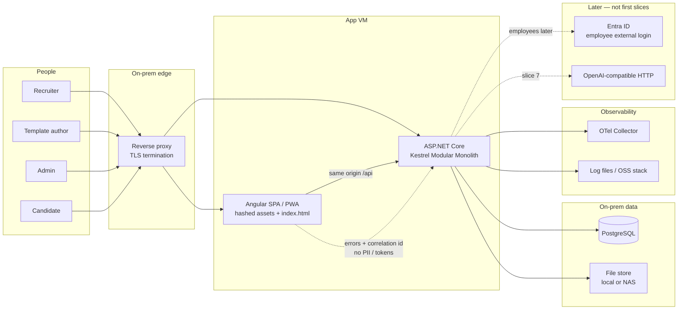
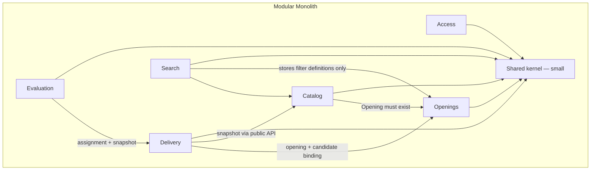

# Interview Quiz Platform — Architecture

Status: v1 architecture record  
Platform skill: `enterprise-architecture-onprem.md`  
Client shape: **Angular SPA + installable PWA, online-first** (no Ionic / Capacitor)  
AuthN (given, not chosen here): **JWT bearer**; ASP.NET Core Identity as the user store; candidate magic-link; Entra ID later as external login. Auth owns issuance, storage, and protocol.  
AuthZ: permission-based capability catalog (see `docs/permissions.md`). Never `[Authorize(Roles = ...)]`.

---

## 1. Goals and constraints

Internal openings-first interview quiz platform. Replaces Microsoft Forms packs. Sits beside hiring process; **not** an ATS, **not** a public career portal.

**Users:** recruiters, specialist template authors (Dev / QA / HR / Finance), admins, candidates.

**v1 goals:** searchable quizzes tied to openings; specialist-owned templates; one quiz model for live and async; AI as draft-only (last slice); tags and saved filters instead of org hierarchy.

**Locked hosting:** on-premises VMs, reverse proxy, self-hosted data. No Azure or AWS services as defaults. No commercial libraries, paid IdPs, paid APM, or paid sync.

**Stack:** ASP.NET Core Modular Monolith, EF Core, PostgreSQL, Angular. REST. Simple DDD. One company (not multi-tenant SaaS).

---

## 2. Assumptions (explicit)

Master defaults are **accepted**; Architecture does not override them:

| Topic | Assumption |
|--------|------------|
| Template edits | New version; existing assignments keep the old version. |
| Assignment | Stores a snapshot of questions, keys, and scoring rules. |
| Quiz reuse | A quiz belongs to **one** opening. Reuse across openings is via **template**. This overrides Brief §6.2 “linked to one or more openings” in favor of Brief §16. |
| Ordering partial credit | Default formula: **adjacent-pair**. Exact implementation is Evaluation (slice 6 / scoring). |
| Retention | Configurable archive (default 5 years). **No hard delete.** Separate restore rules for resumes, attempts, quiz content. Restore is an admin permission (split codes below). |
| Company AI rules | Versioned JSON: global layer + required fields per question type. Concrete schema deferred to the AI slice. |
| Async attempts | One attempt unless the assignment override allows another. |
| Tenancy | Single internal company. |
| AI runtime | Last in Brief §14. Operator-configured **OpenAI-compatible HTTP** endpoint (self-hosted or otherwise). Not Azure OpenAI. First slices have **no LLM**. |
| AuthN | JWT + Identity store + magic-link + Entra-later is a **given**. Architecture does not design Cookie vs JWT. |
| CQRS | **No.** Application services in each module. Never MediatR. See ADR 0005. |
| Data | One PostgreSQL database, module-owned schemas, until a split is justified. See ADR 0003. |
| Files | Resumes and other binaries on local / NAS disk; paths in PostgreSQL. Not a cloud object store. |
| Live progress | REST start / pause / poll in v1. SignalR is optional later (OSS only); not required. |
| Network | SPA and API same-site behind one reverse proxy (simplifies cookies if Auth ever needs them; JWT still works). Split origins need an explicit CORS allowlist — not the default. |
| CI | Self-hosted runners. Exact product (GitHub Actions, GitLab, Jenkins, Azure DevOps Server) is **unknown** — DevOps confirms what ops already run. |

Open questions that remain product/Auth-owned are listed in §11.

---

## 3. Context diagram

Request path: browser → reverse proxy (TLS) → Kestrel. The proxy serves the Angular app and forwards `/api` and `/health` to the monolith. PostgreSQL and the file store are internal. The OTel Collector is the only telemetry backend named here.

---

## 4. Bounded contexts (module map)

One ASP.NET Core host. In-process modules with **public application contracts**; other modules do not read another module’s tables. Shared kernel stays small: identifiers, pagination, tag key–value value object, permission code constants, clock. **No** domain entities in the kernel. Aggregates only where invariants need them (quiz graph, assignment + snapshot, attempt scoring completeness, role as a permission set).

### 4.1 Access

**Language:** user, permission, role (operator-composed bundle), JWT, magic-link, later Entra link.

**Owns:** employee and candidate user records (ASP.NET Core Identity as store), permission catalog seed, roles as permission sets, role assignment, JWT issue / revoke (Auth implements), candidate magic-link issuance/consumption (Auth implements), later Entra as Identity external login. After Entra login the **same app still issues JWTs**.

**Does not own:** Cookie vs JWT choice (already given). Opening/quiz business rules.

**Public contracts (REST, Auth/.NET fill details):**

- `POST /api/auth/login`, `POST /api/auth/refresh`, `POST /api/auth/logout` (revoke)
- Candidate magic-link start/consume (paths owned by Auth)
- `GET /api/me`, `GET /api/me/permissions`
- `GET /api/permissions` — catalog for the role editor (`roles.manage`)
- `GET|POST|PUT|DELETE /api/roles`, assign/unassign users
- `GET|POST|PUT /api/users` (`users.manage`)
- Later: Entra challenge / callback, then app JWT

**In-process:** resolve current user; effective permission set; assignment-scoped candidate principal (resource check, not a role-name check).

**Permissions defined here:** `users.manage`, `roles.manage`, archive restore codes (admin).

### 4.2 Openings

**Language:** opening, handler, dynamic field definition, tag (key–value).

**Owns:** openings (title, JD, owner, dates, headcount, experience, handlers), admin default field keys, per-opening values, extra keys where permitted. No rigid org tree.

**Does not own:** quizzes, assignments, filters UI storage.

**Public contracts:**

- `GET|POST|PUT /api/openings`
- `GET /api/openings/{id}`
- `GET|PUT /api/opening-field-definitions` (`openings.fields.manage`)

**In-process:** `GetOpening(id)` for Catalog (quiz must reference one opening) and Delivery.

**Permissions:** `openings.read`, `openings.write`, `openings.fields.manage`.

### 4.3 Catalog

**Language:** quiz, template, template version, question, question type, scoring mode (auto / AI-assist / human-only), credit mode (partial / all-or-nothing), company AI rule set.

**Owns:** quizzes (working copy under **one** opening), templates and versions, question types listed in Brief §7 (no code questions in v1), per-question scoring and credit modes, company AI rule sets as versioned JSON. AI **draft jobs** in slice 7 (resume + opening + optional template + rules → draft quiz; human edit gate before assign).

**Does not own:** assignment lifecycle, attempts, live session control.

**Public contracts:**

- `GET|POST|PUT /api/quizzes`, `GET /api/quizzes/{id}`
- `POST /api/quizzes/{id}/publish-template` (or equivalent)
- `GET /api/templates`, `GET /api/templates/{id}/versions`
- `GET|POST|PUT /api/ai-rule-sets` (`ai.rules.manage`) — schema in AI slice
- Slice 7: `POST /api/ai-drafts` (`ai.draft.use`); draft is never auto-assigned

**In-process (critical):** `GetQuizSnapshot(quizId)` → immutable DTO of questions, keys, scoring rules for Delivery to persist on assign. `GetTemplateVersion(id)` for clone-into-quiz.

**Permissions:** `quizzes.read`, `quizzes.write`, `templates.read`, `templates.write`, `ai.rules.manage`, `ai.draft.use`.

**Versioning:** template edit → new version. Quizzes are mutable working copies; freeze is the **assignment snapshot**, not a full quiz history in v1.

### 4.4 Delivery

**Language:** assignment, candidate contact, mode (live | async), timing rules, attempt policy, snapshot, live session.

**Owns:** binding of a quiz snapshot to a candidate under an opening; live vs async as a **property of the assignment**; overall and per-section timing; attempt limit (default one async attempt); live start / pause / monitor; magic-link target association (token protocol is Auth). Snapshot rows/JSON at assign time.

**Does not own:** scoring, review workflow, template library.

**Public contracts:**

- `GET|POST /api/assignments`, `GET /api/assignments/{id}`
- `POST /api/assignments/{id}/live/start|pause`
- `GET /api/assignments/{id}/live/progress`
- Candidate-facing assignment/attempt session (Auth-scoped JWT) — exact paths Auth + .NET

**In-process:** `GetAssignmentWithSnapshot(id)` for Evaluation.

**Permissions:** `assignments.read`, `assignments.write`, `sessions.live.run`.

### 4.5 Evaluation

**Language:** attempt, answer, auto-score, AI-assist draft, human review, final result.

**Owns:** attempts (answers, timestamps, duration); immediate auto-score; written items until every non-auto item is settled; AI-assist as **auditable drafts** (suggestion + human confirmation or edit + actor + timestamps); final score/outcome. Archive/restore of attempts metadata (files via file store).

**Does not own:** assignment creation, quiz authoring.

**Public contracts:**

- `GET /api/attempts`, `GET /api/attempts/{id}`
- Candidate submit (scoped)
- `POST /api/attempts/{id}/items/{itemId}/review` (`attempts.review`)
- Slice 6: AI-assist suggestion endpoint (still human-confirm)

**Permissions:** `attempts.read`, `attempts.review`.

### 4.6 Search (saved filters)

**Language:** saved filter, personal vs shared, share-with people / public-inside-company.

**Owns:** stored filter definitions (target: openings or templates/quizzes; criteria JSON; owner; share list). **Does not execute** domain queries — Openings and Catalog list endpoints accept the same criteria shape.

**Public contracts:**

- `GET|POST|PUT|DELETE /api/filters`
- share / unshare

**Permissions:** `filters.write`, `filters.share`. Using unsaved criteria on a list endpoint requires the matching `*.read` permission only.

---

## 5. Data

| Store | Use |
|--------|-----|
| **PostgreSQL** (one database) | All module tables. Schemas: `access`, `openings`, `catalog`, `delivery`, `evaluation`, `search`. JSONB for dynamic fields, question graphs, snapshots, filter criteria, AI rule JSON. |
| **Local / NAS files** | Resume uploads and future attachments. DB holds path + content type + owning module id. |
| Not used in v1 | Redis as a default, document DB, cloud blobs, message bus. |

EF Core migrations, expand/contract. Dummy seed in Development only.

**Retention:** status/archived-at (or equivalent) per policy family — resumes, attempts, quiz/template content. Configurable years (default 5). Restore requires the matching `archive.restore.*` permission. No silent hard delete.

---

## 6. Client shape

**Angular SPA + installable PWA.** Online-first. **No Ionic, no Capacitor, no Nx** unless a later dedicated decision.

| Capability | v1 |
|------------|----|
| Web app manifest + `@angular/service-worker` | Yes — installable on supporting browsers |
| Cache hashed app shell | Yes |
| Cache authenticated APIs, tokens, `/me`, login/refresh, quiz payloads, answers | **No** |
| IndexedDB outbox for attempts | **No** |
| Offline authoring / taking a quiz | **No** — show “you are offline” |
| Timed live/async, scoring, magic-link as offline mutations | **No** (integrity, anti-cheat, resume PII) |

Details: `docs/adr/0004-pwa-online-first.md`. Angular implements; this ADR is the product rule.

Candidate and employee UIs may share the SPA with different routes; Auth owns branded entry routing.

---

## 7. Hosting (on-premises)

Skill used: **`enterprise-architecture-onprem.md`**. Azure/AWS skills were not used.

| Concern | Choice |
|---------|--------|
| Compute | Single Modular Monolith on Kestrel, **behind a reverse proxy** (nginx, IIS, or equivalent already in the datacenter). Containers optional if ops already run Docker — not required to ship. |
| TLS | Terminated at the reverse proxy. HTTP from proxy to Kestrel on the internal network. |
| SPA | Same-site: proxy serves static Angular output and `/api`. |
| PWA cache | Proxy **must not** aggressively cache `index.html` or `ngsw.json` (always revalidate). Hashed assets may be long-cached. |
| Secrets | Environment variables, OS-protected files, or HashiCorp Vault (OSS). **Not** cloud KMS. |
| Observability | App **emits** OpenTelemetry traces/metrics + structured logs. **Goes to** an on-prem OTel Collector and files / existing OSS stack. No paid APM. |
| Health | `GET /health/live` (process), `GET /health/ready` (PostgreSQL + file store). CD waits on ready. |
| Correlation | Accept `traceparent` and/or `X-Correlation-ID`; generate if missing; echo to clients. Angular logs status + correlation id, not bodies with PII. |
| Environments | **Dev** (local seed, Docker Compose PostgreSQL), **Test**, **Prod**. No cloud environment names. |
| Dev data | Docker Compose PostgreSQL for local development. |
| CI/CD | Self-hosted runners; DevOps matches this platform. |
| AI (slice 7) | Configured base URL + secret via env/Vault. Operator’s OpenAI-compatible endpoint. |
| Entra (later) | App calls Entra as external IdP; still issues app JWTs. No paid IdP product. |

Suggested env **names** (values never in git): `ConnectionStrings__InterviewQuiz`, `FileStorage__Root`, `Jwt__*` (Auth), `OTEL_EXPORTER_OTLP_ENDPOINT`, `OTEL_SERVICE_NAME`, `Retention__Years`, later `Ai__BaseUrl` / `Ai__ApiKey`.

---

## 8. Observability — emit vs destination

| Emit (app) | Destination (on-prem) |
|------------|------------------------|
| Structured logs (templates, no secrets) | Files and/or collector |
| OTel traces named after use cases (assign, submit, score, live start) | OTel Collector |
| Metrics: request duration, error rate, dependency duration | OTel Collector |
| Health live/ready | Reverse proxy / CI |
| Angular HTTP failures: status + correlation id | API log ingest or collector; **no tokens, no resume text, no answers** |

Intentionally light in v1: no PWA outbox metrics (no outbox). Do not trace raw quiz payloads or answer bodies. Client OTel JS exporter is optional and not required.

---

## 9. Integration style

- **REST** between Angular and the monolith.
- **In-process** module calls for snapshot, opening existence, assignment fetch.
- **No** integration event bus, sagas, or domain-event storm in v1.
- Cross-module rule: Delivery **copies** a Catalog snapshot at assign time; it does not join live quiz tables at attempt time.

---

## 10. Risks

- **Integrity of timed attempts** if anyone caches or replays quiz payloads — mitigated by online-first PWA rules and no API cache.
- **Resume PII** on disk and in logs — file store ACLs, no PII in telemetry, retention/restore permissions.
- **Magic-link and JWT theft** — Auth + Security; Architecture only records that candidate tokens must be assignment-scoped.
- **Single host capacity / patch windows** — one monolith first; backup and migration outage are ops realities, not invented SLAs.
- **AI endpoint reachability and prompt leakage** (slice 7) — operator-owned HTTP; never default to a cloud LLM.
- **Entra later** must not fork a second authZ model — same permission catalog, same app JWTs.
- **Filter/tag inconsistency** is a product risk (Brief goal 6), not solved by a rigid hierarchy in software.

No numeric SLAs or KPIs are claimed; Brief §13 is qualitative until a Forms baseline exists.

---

## 11. Open questions (owners)

| Question | Owner |
|----------|--------|
| One branded auth entry that routes employee vs candidate (magic-link / password) — exact UX and routes | **Auth** (product still open; working direction in `requirements/Open questions.md`) |
| JWT storage, refresh, magic-link protocol | **Auth** |
| Exact restore UX per policy family (already: separate permissions, no hard delete) | **Master / product**; Access + owning modules implement |
| Concrete company AI JSON schema | **Catalog (.NET)** in slice 7 |
| Adjacent-pair scoring edge cases (ties, duplicate items) | **Evaluation (.NET)** when scoring lands |
| Reverse proxy product, DMZ vs internal zones, Vault vs env | **DevOps** + ops |
| Which self-hosted CI already exists | **DevOps** |
| Threat model of live “watch the screen” vs app-side controls | **Security** (not Architecture) |

---

## 12. First slices (Brief §14)

Vertical slices. Each slice is not done until the collaboration skill DoD holds (permission on API + UI, migrations, tests, correlation id, no secrets, contract updated).

| Slice | What | Modules |
|-------|------|---------|
| **1 Foundations** | Users, permission catalog + role editor, openings + dynamic fields/tags | Access, Openings |
| **2 Authoring** | Quiz editor, question types, scoring modes, credit modes | Catalog |
| **3 Templates and search** | Publish template, versions, list/search, saved/shared filters | Catalog, Search |
| **4 Assignments** | Candidate assignment, snapshot, async timed link, basic results | Delivery, Evaluation (submit + auto-score), Access (magic-link) |
| **5 Live mode** | Start/pause/monitor on the **same** assignment model | Delivery |
| **6 Review** | Human + AI-assist marking, auditable drafts, finalise | Evaluation |
| **7 AI draft** | Resume + opening + rules → draft → forced human edit | Catalog (+ file store, operator LLM HTTP) |

No LLM in slices 1–5. Slice 6 AI-assist may call the same operator endpoint when configured; if unset, human-only review still works.

---

## 13. ADRs

| ADR | Topic |
|-----|--------|
| [0001](adr/0001-hosting-on-premises.md) | On-premises hosting; Azure/AWS out of scope |
| [0002](adr/0002-modular-monolith.md) | Modular Monolith, REST, simple DDD |
| [0003](adr/0003-data-postgresql.md) | PostgreSQL + JSONB; one DB until split |
| [0004](adr/0004-pwa-online-first.md) | Installable PWA, online-first, shell cache only |
| [0005](adr/0005-no-cqrs.md) | No CQRS, no MediatR |
| [0006](adr/0006-auth-given-jwt-identity.md) | JWT + Identity + magic-link + Entra-later as given |

Permission catalog: [`docs/permissions.md`](permissions.md).

---

## 14. Next specialists

1. **Auth** — JWT implementation skill + permission-based access (catalog wiring). Do not redesign Cookie vs JWT.
2. **.NET API** — host, modules, EF Core, OpenAPI, health, OTel emit. Permission placeholders until Auth wires checks.
3. **Angular** — SPA scaffold, then PWA per ADR 0004. No Ionic.
4. **DevOps** — Compose PostgreSQL, reverse proxy cache headers, OTel Collector, self-hosted CI, Dev/Test/Prod.
5. Documentation / Testing / Security in parallel as the collaboration skill allows.

---

## Handoff

See the specialist return to Master (same contract). Artifacts are the paths in §13 plus this file.
